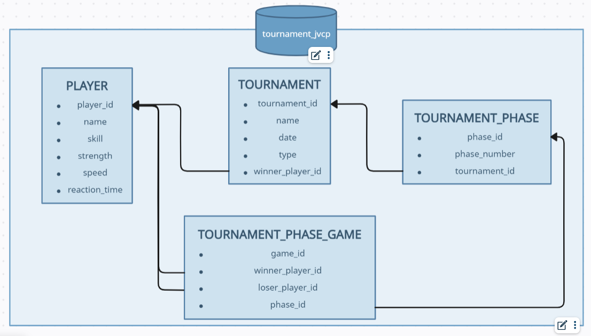

# Tennis Tournament
 Challeng para GeoPagos - API de simulación de torneo de tenis

## Descripción
Esta aplicación se encarga de simular los datos de un torneo de tenis. 
El mismo se juega por una cantidad de jugadores que es potencia de 2 (dos) 
y su modalidad es de eliminación directa, es decir, en cada ronda el jugador que pierde 
es eliminado dela competencia.

## Inicializando Proyecto
### Installing
* Esta API está desarrollada sobre Spring Boot 3.3.2
* Esta API utiliza Java version 17
* Por fines de simplicidad, no se utilizan variables de entorno o secrets

### Ejecutar Aplicación
* La ejecución es sencilla, no requiere de configuraciónes especificas
* Ejecutar como Application seleccionando la clase TennisTournamentApplication como principal 

## Lógica del Torneo
* **Eliminación directa:** En cada juego, el ganador pasa a la siguiente ronda y el perdedor es eliminado del torneo.
* **Emparejamiento:** Los jugadores se enfrentan según un orden aleatorio.
* **Tipo de torneo:** Los torneos solo serán femenino (female) o masculino (male), no hay juegos mixtos.
* **Sin empate:** Si un juego se empata, se vuelve a calcular hasta que haya un ganador.
* **Selección de un ganador:** Se establece un algoritmo de calculo de puntos en cada ronda, el puntaje más alto será el ganador.
* **Cálculo de puntos (hombres):** Para los hombres, los puntos se definen como la suma de la habilidad (skill), la fuerza (strength) dividida en 2, la velocidad (speed) y la suerte (número aleatorio entre 0 y 50)
  * Siendo el mínimo valor posible 0 y el máximo 250
  * La fuerza se divide en 2 para que cada parametro, excepto la habilidad, sume un máximo de 50 puntos
* **Cálculo de puntos (mujeres):** Para las mujeres, los puntos se definen como la suma de la habilidad(skill), la diferencia entre el 1 y el tiempo de reacción (reaction_time) multiplicada por 50 y la suerte (número aleatorio entre 0 y 50).
  * El tiempo de reacción suma más puntos mientras menor sea su valor (mejor reacción, más puntos).
  * El mejor tiempo de respuesta sería 0, dando 50 puntos y el pero sería 1 que equivale a 0 puntos.

## Estructura de la Aplicación
Esta aplicación consta de 2 partes (el manejo de registros de jugadores y de torneos) los mismos se detallan a continuación:
### Manejo de Jugadores
Consta de 5 endpoints para la creación, modificación, borrado (lógico) y consulta de jugadores
* #### Creación de jugador - [POST]() - /geopagos/player
  * Request ejemplo
    ```
    {
        "name": "nombre jugador",
        "skill": 99,
        "gender": "female",
        "reaction_time: 0.3
    }
    ```
  * Response ejemplo
    ```
    {
      "data": [
        {
          "player_id": 10,
          "name": "nombre jugador",
          "skill": 99,
          "gender": "female",
          "reaction_time: 0.3
        }
      ]
    }
    ```
* #### Modificación de jugador - [PUT]() - /geopagos/player/[{playerId}]()
    * Request ejemplo
      ```
      {
          "name": "nuevo nombre",
          "skill": 88,
          "gender": "female",
          "reaction_time: 0.2
      }
      ```
    * Response ejemplo
      ```
      {
        "data": [
          {
            "player_id": 10,
            "name": "nuevo nombre",
            "skill": 88,
            "gender": "female",
            "reaction_time: 0.2
          }
        ]
      }
      ```
* #### Consulta de jugador - [GET]() - /geopagos/player/[{playerId}]()
    * Request N/A
    * Response ejemplo
      ```
      {
        "data": [
          {
            "player_id": 10,
            "name": "nombre jugador",
            "skill": 99,
            "gender": "female",
            "reaction_time": 0.3
          }
        ]
      }
      ```
* #### Consulta de lista jugadores - [GET]() - /geopagos/player
    * Request N/A
    * Response ejemplo
      ```
      {
        "data": [
          {
            "player_id": 10,
            "name": "nombre jugador",
            "skill": 99,
            "gender": "female",
            "reaction_time": 0.3
          },
          {
            "player_id": 11,
            "name": "otro jugador",
            "skill": 78,
            "gender": "male",
            "strength": 81,
            "speed": 38.4
          }
        ]
      }
      ```
* #### Borrado lógico de jugador - [DELETE]() - /geopagos/player/[{playerId}]()
    * Request N/A
    * Response N/A (si se eliminó correctamente, responde un HttpStatus OK)

[Nota:]() Para todos los casos, considerar que si el jugador es femenino (geder = female) se debe indicar el tiempo de reacción (reaction_time), de lo contrario, si es masculino (gender = male) se debe indicar la fuerza (srength) y la velocidad (speed). 
Además el tiempo de reacción debará ser un numero decimal entre 0 y 1, la velocidad un decimal entre 0 y 50 y la fuerza un numero entero entre 0 y 100.

### Manejo de Torneos
Consta de 3 endpoints para la creación de torneos con jugadores seleccionados aleatoriamente de la base de datos, la creación de torneos a partir de una lista de jugadores y un endpoint de consulta de datos de torneos ya persistidos.

Además se debe considerar que la cantidad de jugadores debe ser potencia de 2 independientemente del modo en que se genere el torneo. En caso de indicarse los jugadores, se validará su existencia en la base de datos
* #### Creación de torneo con juadores aleatorios - [POST]() - /geopagos/tournament/random
    * Request ejemplo
      ```
      {
          "name": "nombre de torneo",
          "type": "male",
          "date": "31/12/2023",
          "competitors": 4
      }
      ```
    * Response ejemplo
      ```
      {
        "tournament_id": 3,
        "name": "nombre de torneo",
        "competitors": 4,
        "type": "male",
        "winner": {
          "playerId": 2,
          "name": "Best Player",
          "skill": 100,
          "strength": 100,
          "speed": 50.0
        },
        "phases": [
          {
            "phase_number": 0,
            "phase_games": [
              {
                "game_id": 55,
                "winner_name": "Best Player",
                "loser_name": "Worst Player"
              },
              {
                "game_id": 56,
                "winner_name": "Other Player",
                "loser_name": "Some Other Player"
              }
            ]
          },
          {
            "phase_number": 1,
            "phase_games": [
              {
                "game_id": 57,
                "winner_name": "Best Player",
                "loser_name": "Other Player"
              }
            ]
          }
        ]
      }
      ```
* #### Creación de torneo con lista de juadores - [POST]() - /geopagos/tournament
    * Request ejemplo
      ```
      {
          "name": "nombre de torneo",
          "type": "male",
          "date": "31/12/2023",
          "player_ids": [2, 8, 17, 1]
      }
      ```
    * Response ejemplo
      ```
      {
        "tournament_id": 3,
        "name": "nombre de torneo",
        "competitors": 4,
        "type": "male",
        "winner": {
          "playerId": 2,
          "name": "Best Player",
          "skill": 100,
          "strength": 100,
          "speed": 50.0
        },
        "phases": [
          {
            "phase_number": 0,
            "phase_games": [
              {
                "game_id": 55,
                "winner_name": "Best Player",
                "loser_name": "Worst Player"
              },
              {
                "game_id": 56,
                "winner_name": "Other Player",
                "loser_name": "Some Other Player"
              }
            ]
          },
          {
            "phase_number": 1,
            "phase_games": [
              {
                "game_id": 57,
                "winner_name": "Best Player",
                "loser_name": "Other Player"
              }
            ]
          }
        ]
      }
      ```
* #### Consulta de torneo - [GET]() - /geopagos/tournament
    * Request ejemplo
      ```
      {
          "name": "nombre de torneo",
          "type": "male",
          "date": "31/12/2023"
      }
      ```
    * Response ejemplo
      ```
      {
        "tournament_id": 3,
        "name": "nombre de torneo",
        "competitors": 4,
        "type": "male",
        "winner": {
          "playerId": 2,
          "name": "Best Player",
          "skill": 100,
          "strength": 100,
          "speed": 50.0
        },
        "phases": [
          {
            "phase_number": 0,
            "phase_games": [
              {
                "game_id": 55,
                "winner_name": "Best Player",
                "loser_name": "Worst Player"
              },
              {
                "game_id": 56,
                "winner_name": "Other Player",
                "loser_name": "Some Other Player"
              }
            ]
          },
          {
            "phase_number": 1,
            "phase_games": [
              {
                "game_id": 57,
                "winner_name": "Best Player",
                "loser_name": "Other Player"
              }
            ]
          }
        ]
      }
      ```
[Nota1:]() Para los casos de creación de torneo, todos los datos son requeridos y validados, ante cualquier error se informará con un código y una descripción indicando la falla. 
Para el caso de la consulta es requerido el campo "name" o el campo "date" (al menos uno de los 2 debe estar presente), si están ambos, se realizará la búsqueda por nombre ya que este no puede duplicarse.

[Nota2:]() Si no se indica el nombre, se puede indicar solo "date" o bien "date" y "type" pero en caso de que se encuentre más de n registro, se devolverá un error ya que solo se puede consultar de a un torneo por vez.

[Note3:]() Se permite creación, modificación y consulta de jugadores, pero no la elimincación física (solo borrado lógico).

[Nota4:]() Se permite la creación y la consulta de torneos, pero no se permite la modificación ni la eliminación de los mismos.

## Base de Datos
A continuación se detalla el esqema de base de datos empleado



## Autor
Aplicación diseñada y desarrollada por:
* [Marcelo Adrian Lemma](https://www.linkedin.com/in/marcelo-lemma-0508a7139/)
